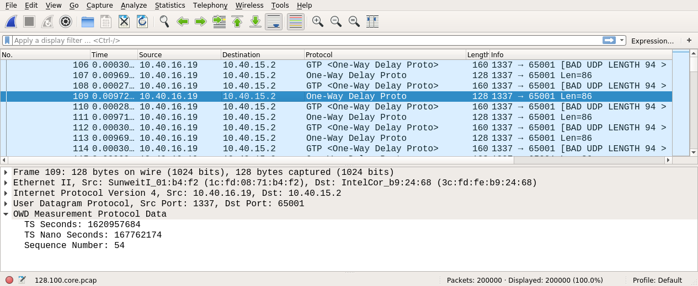
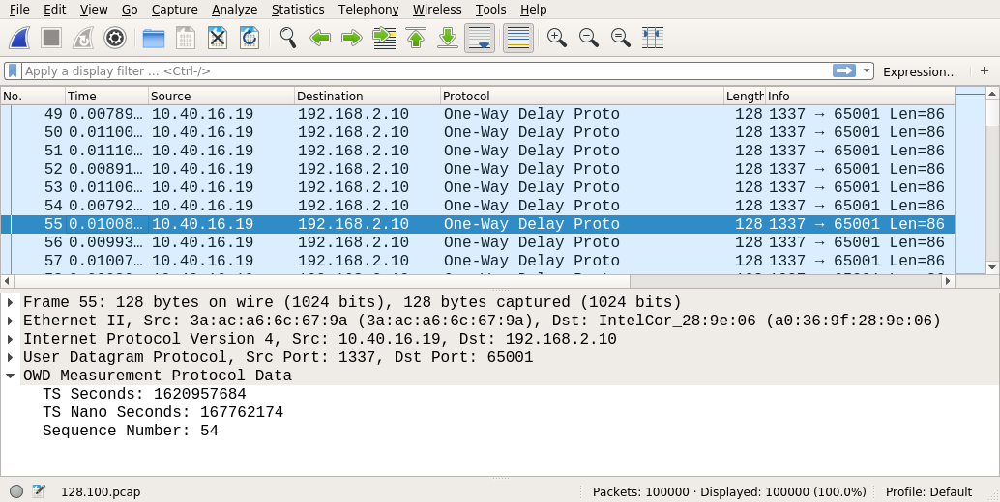

## Structure of measurement data

To generate a PDF from this Markdown file use:
```
$ pandoc README.md -o README.pdf
```

### Content

The measurement data contents traces of the packets sent by the traffic generator via 5G and then captured also at the
traffic generator. In addition also the traffic traversing the core is captured by the traffic generator.
The traces are stored as Packet Captures (PCAPs) with nanosecond timestamp precision.  
The provided data was compressed using gzip, hence to uncompress use:  
```
$ tar -xcvf SA.tar.gz
```

### Structure

The measurement data (PCAPs) is organized as follows:  
```
$ tree SA --charset=ascii
SA
`-- VarParams
    |-- download
    |   |-- 1024.100000.core.pcap
    |   |-- 1024.100000.pcap
    |   |-- 1024.10000.core.pcap
    |   |-- 1024.10000.pcap
    |   |-- 1024.1000.core.pcap
    |   |-- 1024.1000.pcap
....
    `-- upload
        |-- 1024.100000.core.pcap
        |-- 1024.100000.pcap
        |-- 1024.10000.core.pcap
        |-- 1024.10000.pcap
        |-- 1024.1000.core.pcap
        |-- 1024.1000.pcap
...
```
The first directory specifies the connection type either `SA` or `NSA`.  
Next the scenario is specified in this case `VarParams` short for 'Varied Parameters'.
For now this is irrelevant.
After the scenario the traffic direction follows.
The traffic direction can be either `download`, i.e. from traffic generator via core, 
RAN to the end device back to generator, or `upload`, i.e. the opposite direction.

Inside these folders the PCAPs are stored.
There are two types of PCAPs: (i) `*.core.pcap` Core PCAPs containing the mirrored traffic of the core and 
(ii) `*.pcap` (End-to-End) E2E PCAPs containing the packets received at the end devices.  
The file name is divided into `<packet size (bytes)>.<packet rate (packets/s)>.pcap`.

### Captured Packets

The packets are truncated to 160bytes maximum.
Therefore Wireshark complains when the truncated packet is smaller then the specified size in the header.
A Wireshark dissector `owd-measurement-packet-dissector.lua` is available to automatically parse the timestamp and
sequence number of a measurement packet.

The following screenshot shows the content of the `128.100.core.pcap` core PCAP for SA in download direction.



The original measurement packets (*One-Way Delay Proto*) can be seen and its corresponding GTP packet 
(*GTP <One-Way Delay Proto>*).
For the core delay the RX timestamps of the packets are used to calculate the time difference.
E.g. the time difference between packet (Seq.No. 54) 109 and its corresponding GTP packet 110 is about 280us.

At last the received packets from the end device `128.100.pcap` are shown below.



Whereby the RX timestamp of a packet and its TX timestamp (see *OWD Measurement Protocol Data*) give the One-Way Delay.